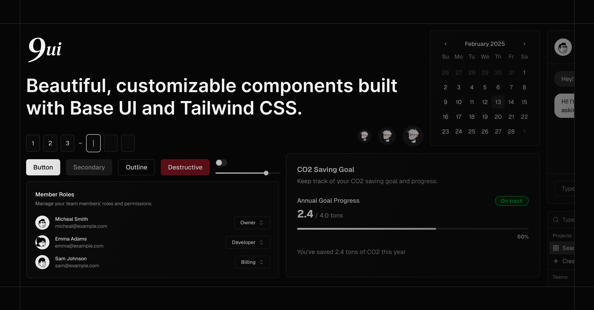

# 9ui (mergd version)

forked from 9ui, but more opinionated on styling.

components to improve:
[ ] tabs
[ ] switch (wip: pretty hard to nail )

A collection of components that you can copy and paste into your project. Built with [Base UI](https://base-ui.com/) and [Tailwind CSS](https://tailwindcss.com/). Easy to customize. Free and open source.

## Documentation

Visit [9ui.dev/docs](https://9ui.dev/docs) for documentation and examples.

## License

Licensed under the [MIT license](./LICENSE).
