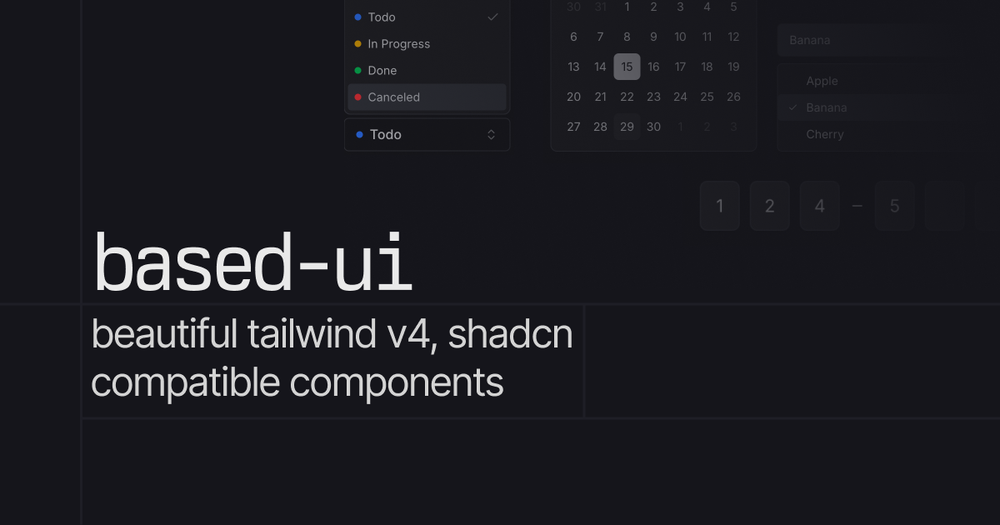

# based-ui (mergd version)

Forked from 9ui, but more opinionated on styling. All credit to [borabaloglu](https://github.com/borabaloglu) for the original implementation and much of the work

A collection of components that you can copy and paste into your project. Built with [Base UI](https://base-ui.com/) and [Tailwind CSS](https://tailwindcss.com/). Easy to customize. Free and open source.

## Documentation

Visit [ui.fldr.zip/docs](https://ui.fldr.zip/docs) for documentation and examples.

## License

Licensed under the [MIT license](./LICENSE).
